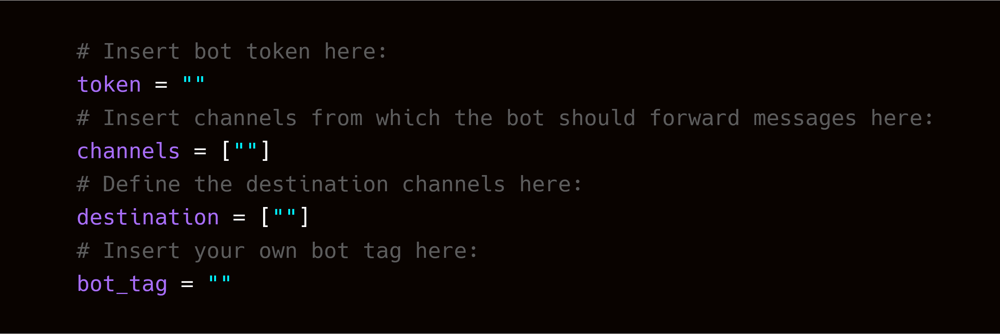

# discord-server-bridge

A Python Discord bot that can be used for bridging two or more servers' channels together.

### [Changelog](./CHANGELOG)

## Setup
In order to obtain your token visit: [Discord Developer Portal](https://discord.com/developers/applications).       

## Screenshots

## Contributing

For guidelines on how to contribute please refer to [CONTRIBUTING.md](./CONTRIBUTING.md).

## License
This project is licensed under the [AGPL-3.0-or-later](https://www.gnu.org/licenses/agpl-3.0.html).

